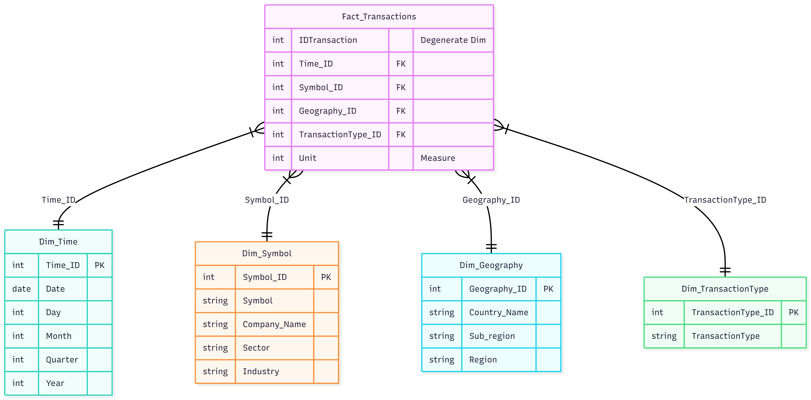

# Project Report: Financial Transactions Data Warehouse

## Introduction
This document outlines the steps taken to implement a Data Warehouse and a dashboard for analyzing financial transactions. The project is divided into three main phases: Star Schema Modeling, Data Transformation, and Dashboard Creation.

## Part 1: Data Warehouse Modeling (Star Schema)

### 1.1 Define the Business Process and the Fact Grain
The core business process is the tracking of financial stock transactions over the year 2024. The star schema was modeled at the most granular level possible, where one row in the `Fact_Transactions` table represents exactly one single transaction from the account statement file.

### 1.2 Identify Fact and Dimensions
The design rigorously separates quantitative data from qualitative data to avoid unnecessary duplication. 
*   **Fact Table:** `Fact_Transactions` contains the only aggregatable measure (`Unit`), the foreign keys, and the original identifier (`IDTransaction`), which was kept as a descriptive attribute directly connected with the fact.
*   **Dimension Tables:** All other descriptive metadata was isolated into four separate dimension tables: `Dim_Time`, `Dim_Geography`, `Dim_Symbol`, and `Dim_TransactionType`.

### 1.3 Define Dimension Hierarchies
To support drill-down and roll-up aggregations, specific logical hierarchies were defined:
*   **Time:** Day -> Month -> Quarter -> Year.
*   **Geography:** Country -> Sub-region -> Region.
*   **Symbol:** Sector -> Industry -> Symbol (Company).

### 1.4 Design the Star Schema & Modeling Choices
The final star schema connects the fact table to the dimension tables using surrogate keys, which were generated for all dimensions and accurately mapped as foreign keys in the central fact table. To avoid data redundancy, the `country` attribute was intentionally excluded from the `Dim_Symbol` table. Instead, it was used solely during the ETL process to create a direct connection between the fact table and `Dim_Geography`.

## Part 2: Data Transformation and Analysis

### 2.1 Load and Clean the Data (Data Quality Checks)
The datasets (account statement, symbols, and country metadata) were loaded, keeping only the attributes required by the dimensional model. In this phase, we made several data quality checks to ensure model integrity:
*   Checked for missing values and removed unused attributes.
*   Verified that every transaction symbol exists in the symbols dataset.
*   *Data Quality Issue Found:* When verifying that every company country could be mapped to the country dataset, we found ot a naming inconsistency. Several countries listed in the symbols file (such as "United States", "United Kingdom", "South Korea", and "Russia") weren't aligned with the official ISO names. To resolve this we used a replacement dictionary to ensure referential integrity before the keys were generated.

### 2.2 Analytical Questions and Main Results
By querying the final denormalized star schema, we extracted answers to the first 5 questions:
1.  **Top Sectors in the US:** Identified the top 5 sectors ranked by the total number of SELL transactions occurring within the United States during 2024.
2.  **Q4 Buying Trends:** Pinpointed the top 5 industries that experienced the highest volume of BUY transactions in the 4th quarter of 2024.
3.  **Quarterly Activity Ranking:** Evaluated and ranked all four quarters of 2024 based on the total number of overall transactions (BUY + SELL).
4.  **Global Sell-Offs:** Extracted the top 10 countries worldwide with the highest count of SELL transactions over the course of 2024.
5.  **Regional Buying Volume:** By aggregating the quantitative `Unit` measure, the analysis revealed the top 5 global regions with the highest total units bought in 2024.

## Part 3: Streamlit Dashboard

We developed a web application using Streamlit to visualize the modeled data and provide insights into the financial dataset, focusing on Time Analysis.

### Core Features & Implementation

*   **KPI Metrics Section:** This displays the Total Transaction Count, Total Units Traded, and the Most Traded Symbol for the selected time period.
*   **Dynamic Filtering & Error Handling:** Here we have a dynamic date range filter  located in the sidebar (defaulting to the entire year: 01/01/2024 - 31/12/2024). Data is processed in real-time using Pandas, ensuring that all visualizations update instantly based on the user's selection. 
*   **Interactive Visualizations:** 
    *   **Trend Analysis:** A line chart tracks and displays the total number of transactions over the selected timeline.
    *   **Categorical Breakdowns:** A multi-column layout highlights bar charts for the top 3 traded symbols, top 5 sectors, and top 5 industries, ranked by transaction count.